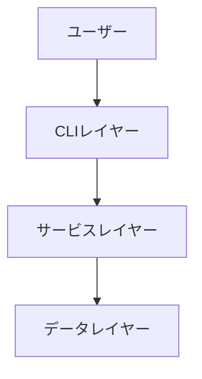
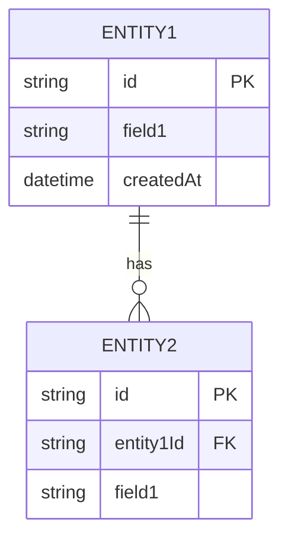
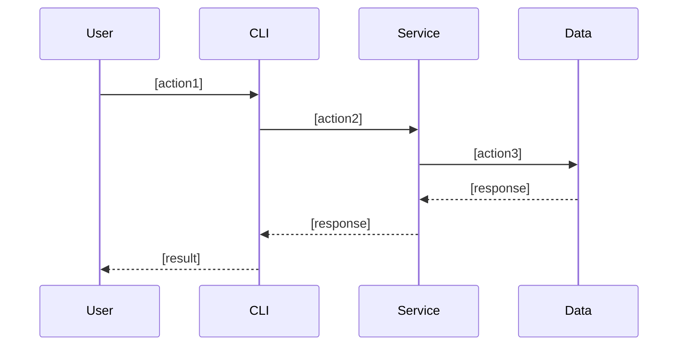
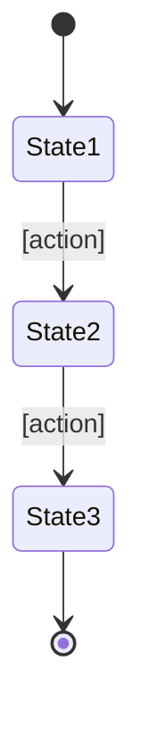

# 機能設計書 (Functional Design Document)

## システム構成図



## 技術スタック

| 分類 | 技術 | 選定理由 |
|------|------|----------|
| 言語 | [言語名] | [理由] |
| フレームワーク | [名称] | [理由] |
| データベース | [名称] | [理由] |
| ツール | [名称] | [理由] |

## データモデル定義

### エンティティ: [エンティティ名]

```typescript
interface [EntityName] {
  id: string;              // UUID
  [field1]: [type];        // [説明]
  [field2]: [type];        // [説明]
  createdAt: Date;         // 作成日時
  updatedAt: Date;         // 更新日時
}
```

**制約**:
- [制約1]
- [制約2]

### ER図



## コンポーネント設計

### [コンポーネント1]

**責務**:
- [責務1]
- [責務2]

**インターフェース**:
```typescript
class [ComponentName] {
  [method1]([params]): [return];
  [method2]([params]): [return];
}
```

**依存関係**:
- [依存先1]
- [依存先2]

## ユースケース図

### [ユースケース1]



**フロー説明**:
1. [ステップ1]
2. [ステップ2]
3. [ステップ3]

## 画面遷移図(該当する場合)



## API設計(該当する場合)

### [エンドポイント1]

```
POST /api/[resource]
```

**リクエスト**:
```json
{
  "[field]": "[value]"
}
```

**レスポンス**:
```json
{
  "id": "uuid",
  "[field]": "[value]"
}
```

**エラーレスポンス**:
- 400 Bad Request: [条件]
- 404 Not Found: [条件]
- 500 Internal Server Error: [条件]

## アルゴリズム設計（該当する場合）

### [アルゴリズム名]

**目的**: [説明]

**計算ロジック**:

#### ステップ1: [ステップ名]
- [詳細説明]
- 計算式: `[式]`
- スコア範囲: 0-100点

#### ステップ2: [ステップ名]
- [詳細説明]
- 計算式: `[式]`
- スコア範囲: 0-100点

#### ステップ3: 総合スコア計算
- 加重平均: `総合スコア = (ステップ1 × 重み1) + (ステップ2 × 重み2)`
- 重み配分:
  - ステップ1: [%]
  - ステップ2: [%]

#### ステップ4: 分類
- [分類1]: スコア >= [閾値]
- [分類2]: [閾値] <= スコア < [閾値]
- [分類3]: スコア < [閾値]

**実装例**:
```typescript
function [algorithmName]([params]): [return] {
  // ステップ1
  const score1 = [calculation];

  // ステップ2
  const score2 = [calculation];

  // 総合スコア
  const totalScore = (score1 * weight1) + (score2 * weight2);

  // 分類
  if (totalScore >= threshold1) return '[分類1]';
  if (totalScore >= threshold2) return '[分類2]';
  return '[分類3]';
}
```

## UI設計（該当する場合）

### テーブル表示

**表示項目**:
| 項目 | 説明 | フォーマット |
|------|------|-------------|
| [項目1] | [説明] | [フォーマット] |
| [項目2] | [説明] | [フォーマット] |

### カラーコーディング

**色の使い分け**:
- [色1]: [用途] (例: 緑 = 完了)
- [色2]: [用途] (例: 黄 = 進行中)
- [色3]: [用途] (例: 赤 = 未着手)

### インタラクティブモード（該当する場合）

**操作フロー**:
1. [操作1]
2. [操作2]
3. [操作3]

## ファイル構造（該当する場合）

**データ保存形式**:
```
[directory]/
├── [file1].json    # [説明]
└── [file2].json    # [説明]
```

**ファイル内容例**:
```json
{
  "[field]": "[value]"
}
```

## パフォーマンス最適化

- [最適化1]: [説明]
- [最適化2]: [説明]

## セキュリティ考慮事項

- [考慮事項1]: [対策]
- [考慮事項2]: [対策]

## エラーハンドリング

### エラーの分類

| エラー種別 | 処理 | ユーザーへの表示 |
|-----------|------|-----------------|
| [種別1] | [処理内容] | [メッセージ] |
| [種別2] | [処理内容] | [メッセージ] |

## テスト戦略

### ユニットテスト
- [対象1]
- [対象2]

### 統合テスト
- [シナリオ1]
- [シナリオ2]

### E2Eテスト
- [シナリオ1]
- [シナリオ2]