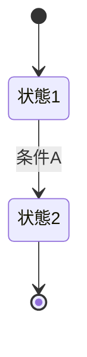

# プロジェクト用語集 (Glossary)

## 概要

このドキュメントは、プロジェクト内で使用される用語の定義を管理します。

**更新日**: [YYYY-MM-DD]

## ドメイン用語

プロジェクト固有のビジネス概念や機能に関する用語。

### [用語1]

**定義**: [明確な定義]

**説明**: [詳細な説明]

**関連用語**: [関連する他の用語]

**使用例**:
- [例1]
- [例2]

**英語表記**: [English Term]

### [用語2]

**定義**: [明確な定義]

**説明**: [詳細な説明]

**関連用語**: [関連する他の用語]

**使用例**:
- [例1]
- [例2]

## 技術用語

プロジェクトで使用している技術・フレームワーク・ツールに関する用語。

### [技術1]

**定義**: [技術の説明]

**公式サイト**: [URL]

**本プロジェクトでの用途**: [どのように使用しているか]

**バージョン**: [使用バージョン]

**関連ドキュメント**: [内部ドキュメントへのリンク]

### [技術2]

**定義**: [技術の説明]

**公式サイト**: [URL]

**本プロジェクトでの用途**: [どのように使用しているか]

**バージョン**: [使用バージョン]

## 略語・頭字語

### [略語1]

**正式名称**: [Full Name]

**意味**: [説明]

**本プロジェクトでの使用**: [どこで使われているか]

### [略語2]

**正式名称**: [Full Name]

**意味**: [説明]

**本プロジェクトでの使用**: [どこで使われているか]

## アーキテクチャ用語

システム設計・アーキテクチャに関する用語。

### [概念1]

**定義**: [アーキテクチャ概念の説明]

**本プロジェクトでの適用**: [どのように実装されているか]

**関連コンポーネント**: [関連するコンポーネント名]

**図解**:
```
[ASCII図またはMermaid図]
```

### [概念2]

**定義**: [アーキテクチャ概念の説明]

**本プロジェクトでの適用**: [どのように実装されているか]

## ステータス・状態

システム内で使用される各種ステータスの定義。

### [ステータス種別1]

| ステータス | 意味 | 遷移条件 | 次の状態 |
|----------|------|---------|---------|
| [状態1] | [説明] | [条件] | [次の状態] |
| [状態2] | [説明] | [条件] | [次の状態] |

**状態遷移図**:


## データモデル用語

データベース・データ構造に関する用語。

### [エンティティ1]

**定義**: [エンティティの説明]

**主要フィールド**:
- `field1`: [説明]
- `field2`: [説明]

**関連エンティティ**: [関連するエンティティ]

**制約**: [ユニーク制約、外部キー制約など]

## エラー・例外

システムで定義されているエラーと例外。

### [エラー種別1]

**クラス名**: `[ErrorClassName]`

**発生条件**: [どういう時に発生するか]

**対処方法**: [ユーザー/開発者はどう対処すべきか]

**エラーコード**: [該当する場合]

**例**:
```typescript
throw new [ErrorClassName]('[メッセージ]');
```

## 計算・アルゴリズム(該当する場合)

特定の計算方法やアルゴリズムに関する用語。

### [計算方法1]

**定義**: [計算方法の説明]

**計算式**:
```
[数式]
```

**実装箇所**: `src/[path]/[file].ts`

**例**:
```
入力: [例]
出力: [結果]
```