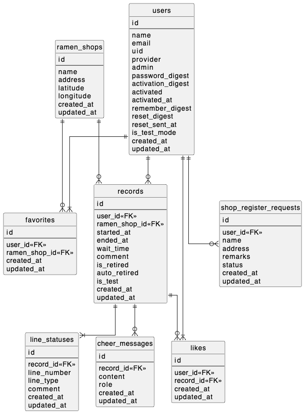
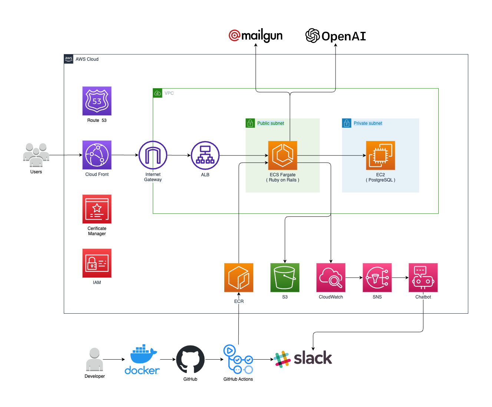

## 🍜 ちゃくどんとは?
ラーメン待ち時間計測・シェアWebアプリです。

🔗 https://tyakudon.com

アプリ紹介ビデオはこちら

🔗 https://youtu.be/HobXb57a8OI?si=PGUnzGXE-uVDIcGU

## 🔧 用途
* ラーメン店に並ぶ（接続）〜ラーメンが提供される（着丼）までの待ち時間を計測
* 記録された待ち時間である「ちゃくどんレコード」の閲覧

|待ち時間計測|ちゃくどんレコードの閲覧|
|---|---|
|||

## ⭐️ 機能の詳細
- ちゃくどんレコードの計測・記録
- 待ちユーザーへの定期的な応援メッセージ出力（OpenAI使用）
- ラーメン店舗情報をスクレイピング
- 店舗登録リクエスト機能
- 店舗お気に入り機能
- ログイン機能（通常ログイン・Googleログイン）
- ちゃくどんレコードへのいいね機能

## 🖥 ER図

## ⚙️ インフラ構成＆連携サービス

## 📌 開発環境
### フロントエンド
* HTML/CSS
* Bootstrap
* Hotwire(Turbo, Stimulus)

### バックエンド
* ruby 3.2.2
* Ruby on Rails 7.0.4.3
* PostgreSQL 14.6

### インフラ・ツール
* AWS(EC2, ECS, ELB, CloudFront, SNS, CloudWatch, ChatBot, IAM, S3)
* RuboCop
* RSpec

### 使用したGem（抜粋）

|Gem|用途|
|----|----|
|geocoder          |ジオコーディング機能 |
|ruby-openai       |応援メッセージ生成機能 |
|google_drive      |スクレイピング情報の蓄積 |
