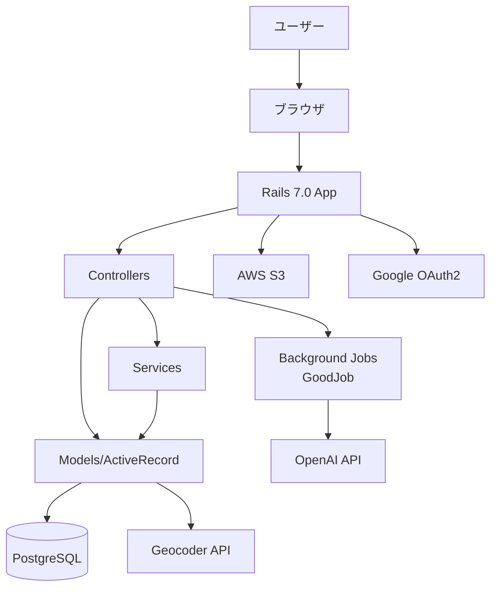
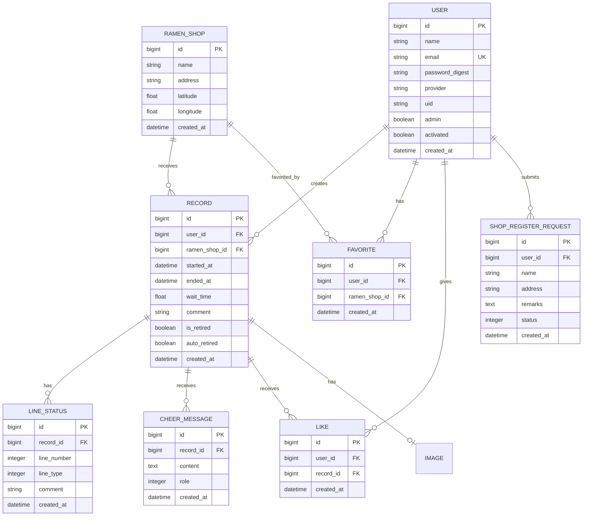
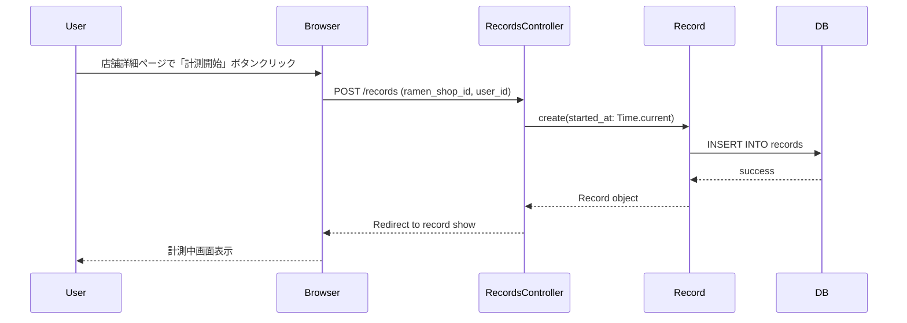
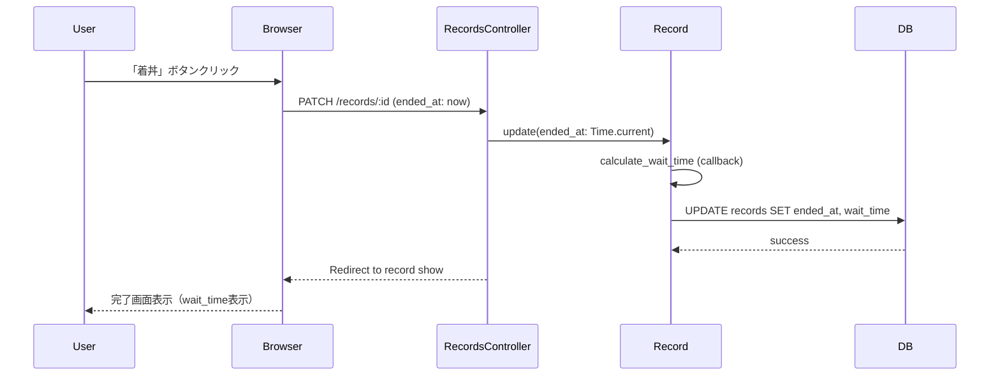
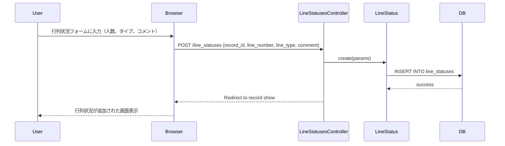
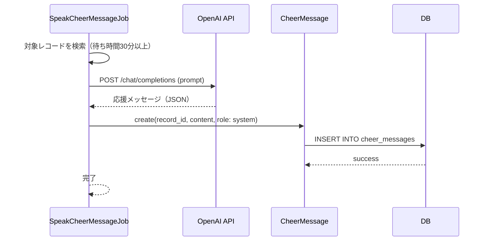
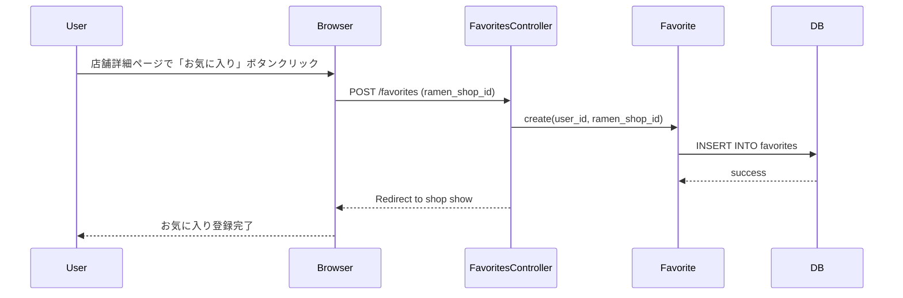
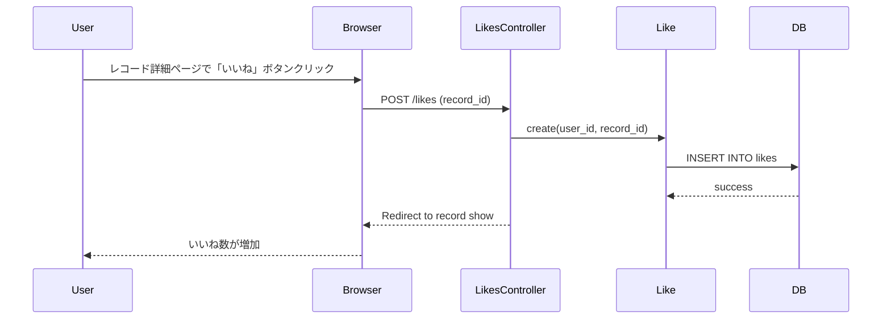
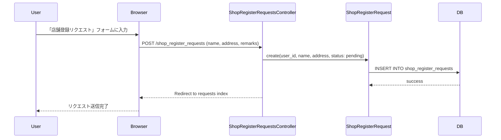

# 機能設計書 (Functional Design Document)

## システム構成図



## 技術スタック

> **詳細**: 技術スタックの完全な一覧、アーキテクチャ設計、セキュリティ要件、パフォーマンス要件については [architecture.md](./architecture.md) を参照してください。

## データモデル定義

### エンティティ: User（ユーザー）

```ruby
class User < ApplicationRecord
  has_secure_password
  has_many :records, dependent: :destroy
  has_many :favorites, dependent: :destroy
  has_many :likes, dependent: :destroy
  has_many :shop_register_requests, dependent: :destroy
end
```

**属性**:
- `id`: bigint (PK)
- `name`: string - ユーザー名
- `email`: string (unique) - メールアドレス
- `password_digest`: string - パスワードハッシュ（bcrypt）
- `provider`: string - OAuth プロバイダー（"google_oauth2"）
- `uid`: string - OAuth UID
- `admin`: boolean (default: false) - 管理者フラグ
- `activated`: boolean (default: false) - メール認証済みフラグ
- `activation_digest`: string - メール認証用トークン
- `activated_at`: datetime - メール認証日時
- `reset_digest`: string - パスワードリセット用トークン
- `reset_sent_at`: datetime - パスワードリセット送信日時
- `is_test_mode`: boolean (default: false) - テストモードフラグ
- `created_at`, `updated_at`: datetime

**インデックス**:
- `email` (unique)
- `[uid, provider]` (unique)

**制約**:
- メール認証が必要（`activated = true`）でなければログイン不可
- パスワード認証 or OAuth認証のどちらかが必須

### エンティティ: RamenShop（ラーメン店舗）

```ruby
class RamenShop < ApplicationRecord
  geocoded_by :address
  after_validation :geocode

  has_many :records, dependent: :destroy
  has_many :favorites, dependent: :destroy

  validates :name, presence: true
  validates :address, presence: true
  validates :latitude, presence: true
  validates :longitude, presence: true
end
```

**属性**:
- `id`: bigint (PK)
- `name`: string (not null) - 店舗名
- `address`: string (not null) - 住所
- `latitude`: float (not null) - 緯度
- `longitude`: float (not null) - 経度
- `created_at`, `updated_at`: datetime

**インデックス**:
- `[name, address]` (unique)

**制約**:
- `name` + `address` の組み合わせがユニーク
- Geocoderで住所から自動的に緯度経度を取得

### エンティティ: Record（待ち時間記録）

```ruby
class Record < ApplicationRecord
  belongs_to :user
  belongs_to :ramen_shop
  has_many :line_statuses, dependent: :destroy
  has_many :cheer_messages, dependent: :destroy
  has_many :likes, dependent: :destroy
  has_one_attached :image  # Active Storage

  before_save :calculate_wait_time

  private

  def calculate_wait_time
    if started_at.present? && ended_at.present?
      self.wait_time = (ended_at - started_at) # 秒単位で保存
    end
  end
end
```

**属性**:
- `id`: bigint (PK)
- `user_id`: bigint (FK, not null) - ユーザーID
- `ramen_shop_id`: bigint (FK, not null) - 店舗ID
- `started_at`: datetime - 並び始め日時
- `ended_at`: datetime - 着丼日時
- `wait_time`: float - 待ち時間（分単位）
- `comment`: string - コメント
- `is_retired`: boolean (default: false) - 手動終了フラグ
- `auto_retired`: boolean (default: false) - 自動終了フラグ
- `is_test`: boolean (default: false) - テストデータフラグ
- `created_at`, `updated_at`: datetime

**インデックス**:
- `user_id`
- `ramen_shop_id`
- `[user_id, created_at]`

**制約**:
- `user_id` と `ramen_shop_id` は必須
- `wait_time` は `ended_at` と `started_at` から自動計算
- 1日経過した計測中レコード（`started_at` あり、`ended_at` なし）は `AutoRetireRecordJob` で自動終了

**状態定義**:
- **計測中**: `started_at.present? && ended_at.nil? && !is_retired`
- **完了**: `ended_at.present?`
- **手動終了**: `is_retired == true`
- **自動終了**: `auto_retired == true`

### エンティティ: LineStatus（行列状況）

```ruby
class LineStatus < ApplicationRecord
  belongs_to :record

  enum line_type: {
    inside_the_store: 1,    # 店内待ち
    outside_the_store: 2,   # 店外待ち
    seated: 3               # 着席済み
  }
end
```

**属性**:
- `id`: bigint (PK)
- `record_id`: bigint (FK, not null) - レコードID
- `line_number`: integer - 待ち人数
- `line_type`: integer (enum) - 行列タイプ
- `comment`: string - コメント
- `created_at`, `updated_at`: datetime

**インデックス**:
- `record_id`

**line_type enum**:
| 値 | 定数 | 意味 |
|---|------|------|
| 1 | inside_the_store | 店内待ち |
| 2 | outside_the_store | 店外待ち |
| 3 | seated | 着席済み |

### エンティティ: CheerMessage（応援メッセージ）

```ruby
class CheerMessage < ApplicationRecord
  belongs_to :record

  enum role: {
    assistant: 10,  # OpenAI生成
    user: 20        # ユーザー投稿
  }
end
```

**属性**:
- `id`: bigint (PK)
- `record_id`: bigint (FK, not null) - レコードID
- `content`: text - メッセージ内容
- `role`: integer (enum) - 送信者種別
- `created_at`, `updated_at`: datetime

**インデックス**:
- `record_id`

**role enum**:
| 値 | 定数 | 意味 |
|---|------|------|
| 10 | assistant | OpenAIが生成 |
| 20 | user | ユーザーが投稿 |

### エンティティ: Favorite（お気に入り）

```ruby
class Favorite < ApplicationRecord
  belongs_to :user
  belongs_to :ramen_shop

  validates :user_id, uniqueness: { scope: :ramen_shop_id }
end
```

**属性**:
- `id`: bigint (PK)
- `user_id`: bigint (FK, not null) - ユーザーID
- `ramen_shop_id`: bigint (FK, not null) - 店舗ID
- `created_at`, `updated_at`: datetime

**インデックス**:
- `user_id`
- `ramen_shop_id`
- `[user_id, ramen_shop_id]` (unique)

**制約**:
- 同じユーザーが同じ店舗を複数回お気に入りできない

### エンティティ: Like（いいね）

```ruby
class Like < ApplicationRecord
  belongs_to :user
  belongs_to :record

  validates :user_id, uniqueness: { scope: :record_id }
end
```

**属性**:
- `id`: bigint (PK)
- `user_id`: bigint (FK, not null) - ユーザーID
- `record_id`: bigint (FK, not null) - レコードID
- `created_at`, `updated_at`: datetime

**インデックス**:
- `user_id`
- `record_id`
- `[user_id, record_id]` (unique)

**制約**:
- 同じユーザーが同じレコードに複数回いいねできない

### エンティティ: FAQ（よくある質問）

```ruby
class FAQ < ApplicationRecord
  validates :question, presence: true
  validates :answer, presence: true
end
```

**属性**:
- `id`: bigint (PK)
- `question`: string (not null) - 質問
- `answer`: string (not null) - 回答
- `created_at`, `updated_at`: datetime

### エンティティ: ShopRegisterRequest（店舗登録リクエスト）

```ruby
class ShopRegisterRequest < ApplicationRecord
  belongs_to :user

  enum status: {
    pending: 0,   # 承認待ち
    approved: 1,  # 承認済み
    rejected: 2   # 却下
  }
end
```

**属性**:
- `id`: bigint (PK)
- `user_id`: bigint (FK, not null) - リクエストユーザーID
- `name`: string (not null) - 店舗名
- `address`: string (not null) - 住所
- `remarks`: text - 備考
- `status`: integer (enum, default: 0) - ステータス
- `created_at`, `updated_at`: datetime

**インデックス**:
- `user_id`
- `[address, name]` (unique)

**status enum**:
| 値 | 定数 | 意味 |
|---|------|------|
| 0 | pending | 承認待ち |
| 1 | approved | 承認済み |
| 2 | rejected | 却下 |

## ER図



## コンポーネント設計

### アーキテクチャレイヤー

```
┌─────────────────────────────────────────┐
│  Presentation Layer (Views + Hotwire)   │
│  ← ERB templates, Stimulus controllers  │
├─────────────────────────────────────────┤
│  Application Layer (Controllers)        │
│  ← Request handling, params validation  │
├─────────────────────────────────────────┤
│  Business Logic Layer (Services/Models) │
│  ← Domain logic, validations            │
├─────────────────────────────────────────┤
│  Data Layer (ActiveRecord + PostgreSQL) │
│  ← Persistence, queries                 │
└─────────────────────────────────────────┘
```

### Controllers Layer（app/controllers/）

**責務**:
- HTTPリクエストの受付とパラメータ検証
- ビジネスロジック層（Services/Models）への委譲
- レスポンスの生成（HTML/JSON/リダイレクト）
- 認証・認可チェック

**主要コントローラー**:

#### RecordsController
- `index`: レコード一覧表示
- `show`: レコード詳細表示
- `new`: 新規レコード作成フォーム
- `create`: レコード作成（`started_at`記録）
- `edit`: レコード編集フォーム
- `update`: レコード更新（`ended_at`記録、`wait_time`計算）
- `destroy`: レコード削除

#### RamenShopsController
- `index`: 店舗一覧表示
- `show`: 店舗詳細表示（レコード統計含む）
- `search`: 店舗検索

#### LineStatusesController
- `create`: 行列状況投稿
- `update`: 行列状況更新
- `destroy`: 行列状況削除

#### FavoritesController
- `create`: お気に入り登録
- `destroy`: お気に入り解除
- `index`: お気に入り一覧

#### LikesController
- `create`: いいね登録
- `destroy`: いいね解除

#### SessionsController
- `new`: ログインフォーム
- `create`: ログイン処理
- `destroy`: ログアウト処理

#### UsersController
- `new`: ユーザー登録フォーム
- `create`: ユーザー登録処理
- `edit`: プロフィール編集フォーム
- `update`: プロフィール更新

#### OmniauthUsersController
- `create`: Google OAuth2 コールバック処理

#### CheerMessagesController
- `index`: 応援メッセージ一覧表示

### Services Layer（app/services/）

**責務**:
- 複雑なビジネスロジックのカプセル化
- 外部API連携
- データ抽出・変換処理

**主要サービス**:

#### DocumentFetcher
- **責務**: Webページのスクレイピング
- **メソッド**: `fetch(url)` → HTML文字列を返す
- **依存**: HTTPクライアント（Net::HTTP）

#### ShopInfoExtractor
- **責務**: HTMLから店舗情報を抽出
- **メソッド**: `extract(html)` → 店舗情報のハッシュを返す
- **依存**: Nokogiri（HTMLパーサー）

#### ShopInfoInserter
- **責務**: 抽出した店舗情報をDBに登録
- **メソッド**: `insert(shop_info)` → RamenShopオブジェクトを返す
- **依存**: RamenShopモデル、Geocoder

#### GoogleSpreadSheet
- **責務**: Google Sheets連携（スクレイピングワークフロー管理）
- **メソッド**: `read_urls`, `write_results`
- **依存**: Google Sheets API

#### GcpSessionManager
- **責務**: Google API認証管理
- **メソッド**: `authorize` → 認証セッションを返す
- **依存**: Google Auth Library

#### UrlManager
- **責務**: URL正規化・検証
- **メソッド**: `normalize(url)` → 正規化されたURLを返す

### Background Jobs Layer（app/jobs/）

**責務**:
- 非同期処理の実行
- 定期実行タスク

**主要ジョブ**:

#### AutoRetireRecordJob
- **責務**: 1日経過した計測中レコードを自動終了し、ユーザーにメール通知
- **トリガー**: Record作成時に `schedule_auto_retire` コールバックで1日後に実行をスケジュール
- **処理内容**:
  1. `ended_at` が nil のレコードを対象
  2. `record.auto_retire!` を実行してレコードを終了
  3. `UserMailer.notify_retirement` でユーザーにメール通知
- **依存**: Recordモデル、UserMailer

#### SpeakCheerMessageJob
- **責務**: OpenAI APIで応援メッセージを生成
- **トリガー**: レコード作成時（条件付き）
- **処理内容**:
  1. OpenAI APIに待ち時間情報を送信
  2. 応援メッセージを生成
  3. CheerMessageを作成
- **依存**: OpenAI API、CheerMessageモデル

## ユースケース

### UC-1: 待ち時間測定開始

**アクター**: ログイン済みユーザー

**前提条件**:
- ユーザーがログイン済み
- ラーメン店舗が登録済み

**シーケンス図**:



**事後条件**:
- Recordが作成される（`started_at`が記録済み、`ended_at`はnil）
- 計測中画面にリダイレクトされる

---

### UC-2: 着丼記録（計測終了）

**アクター**: ログイン済みユーザー

**前提条件**:
- 計測中のRecordが存在する

**シーケンス図**:



**事後条件**:
- `ended_at`が記録される
- `wait_time`が自動計算される（分単位）
- 完了画面にリダイレクトされる

---

### UC-3: リアルタイム行列状況共有

**アクター**: ログイン済みユーザー

**前提条件**:
- 計測中のRecordが存在する

**シーケンス図**:



**事後条件**:
- LineStatusが作成される
- レコード詳細画面に行列状況が表示される

---

### UC-4: 応援メッセージ生成

**アクター**: システム（バックグラウンドジョブ）

**前提条件**:
- 計測中のRecordが存在する
- 待ち時間が一定以上（例: 30分以上）

**シーケンス図**:



**事後条件**:
- CheerMessageが作成される
- ユーザーがレコード画面で応援メッセージを確認できる

---

### UC-5: お気に入り登録

**アクター**: ログイン済みユーザー

**前提条件**:
- ユーザーがログイン済み
- 店舗が存在する

**シーケンス図**:



**事後条件**:
- Favoriteが作成される
- ボタンが「お気に入り解除」に変わる

---

### UC-6: いいね

**アクター**: ログイン済みユーザー

**前提条件**:
- レコードが存在する
- ユーザーがログイン済み

**シーケンス図**:



**事後条件**:
- Likeが作成される
- いいね数が1増える

---

### UC-7: 店舗登録リクエスト

**アクター**: ログイン済みユーザー

**前提条件**:
- ユーザーがログイン済み
- 希望する店舗が未登録

**シーケンス図**:



**事後条件**:
- ShopRegisterRequestが作成される（status: pending）
- 管理者が承認/却下を行う

---

## UI設計

### フロントエンド技術スタック

- **Bootstrap 5**: レスポンシブグリッドシステム、コンポーネント
- **Hotwire (Turbo + Stimulus)**: SPA風の高速ページ遷移、部分更新
- **ERBテンプレート**: サーバーサイドレンダリング

### 主要画面

#### 1. トップページ（`/`）
- 最新レコード一覧
- 人気店舗ランキング
- 検索フォーム

#### 2. 店舗一覧（`/ramen_shops`）
- 店舗カード（名前、住所、平均待ち時間）
- ページネーション
- 検索・フィルター

#### 3. 店舗詳細（`/ramen_shops/:id`）
- 店舗情報（名前、住所、地図）
- 「計測開始」ボタン
- レコード一覧（統計情報含む）
- お気に入りボタン

#### 4. レコード詳細（`/records/:id`）
- 待ち時間（wait_time）
- コメント
- 写真
- 行列状況一覧
- 応援メッセージ
- いいねボタン

#### 5. ユーザープロフィール（`/users/:id`）
- ユーザー情報
- レコード一覧
- お気に入り店舗一覧

### Hotwireによる高速化

- **Turbo Drive**: ページ遷移の高速化（全体リロードなし）
- **Turbo Frames**: 部分更新（いいねボタン、行列状況追加など）
- **Stimulus**: JavaScriptインタラクション（フォームバリデーション、モーダル表示など）

## アルゴリズム設計

### 待ち時間計算

```ruby
# Record model
def calculate_wait_time
  if started_at.present? && ended_at.present?
    self.wait_time = (ended_at - started_at) # 秒単位で保存
  end
end
```

**計算式**:
```
wait_time (秒) = (ended_at - started_at) / 60.0
```

**例**:
- `started_at`: 2025-01-25 11:00:00
- `ended_at`: 2025-01-25 11:45:30
- `wait_time`: 45.5分

### 自動終了処理（AutoRetireRecordJob）

```ruby
class AutoRetireRecordJob < ApplicationJob
  def perform(record)
    return if record.ended_at?

    record.auto_retire!
    UserMailer.notify_retirement(record.user, record).deliver_now
  end
end
```

**トリガー**: Record作成時に `schedule_auto_retire` コールバックで1日後に実行をスケジュール

**条件**:
- `ended_at` が nil のレコードを対象

**処理**:
1. `record.auto_retire!` を実行してレコードを終了（`auto_retired = true` を設定）
2. `UserMailer.notify_retirement` でユーザーにメール通知

## エラーハンドリング

### ActiveRecord Validation Errors

**User**:
- メールアドレス重複: "このメールアドレスは既に登録されています"
- パスワード形式エラー: "パスワードは6文字以上である必要があります"

**RamenShop**:
- 店舗名・住所の重複: "この店舗は既に登録されています"
- Geocoderエラー: "住所から位置情報を取得できませんでした"

**Record**:
- ユーザーID不正: "ユーザーが存在しません"
- 店舗ID不正: "店舗が存在しません"

### External API Errors

**OpenAI API**:
- リクエスト失敗: ログに記録し、デフォルトメッセージを表示
- タイムアウト: リトライ処理（最大3回）

**Geocoder API**:
- 位置情報取得失敗: エラーメッセージを表示し、手動で緯度経度を入力させる

## パフォーマンス最適化

### データベースインデックス

**重要なインデックス**:
- `users(email)` - ログイン時の高速検索
- `ramen_shops([name, address])` - 重複チェック
- `records(user_id, created_at)` - ユーザーのレコード一覧表示
- `favorites([user_id, ramen_shop_id])` - お気に入り重複チェック
- `likes([user_id, record_id])` - いいね重複チェック

### N+1問題の回避

```ruby
# Bad: N+1問題
@records = Record.all
@records.each do |record|
  puts record.user.name  # N回のクエリ
end

# Good: eager loading
@records = Record.includes(:user, :ramen_shop).all
```

**開発環境でのチェック**:
- Bullet gem を使用してN+1を検出

### ページネーション

```ruby
# Kaminari gem
@records = Record.page(params[:page]).per(20)
```

**設定**:
- 1ページあたり20件表示
- 大量データでもパフォーマンスを維持

### Turboによる高速化

- ページ遷移時に全体リロードなし
- 必要な部分のみサーバーから取得・更新

## セキュリティ考慮事項

### 認証・認可

**認証**:
- bcryptによるパスワードハッシュ化（`has_secure_password`）
- Google OAuth2（`omniauth-google-oauth2`）
- メール認証（`activated`フラグ）

**認可**:
- ログイン済みユーザーのみレコード作成可能
- 自分のレコードのみ編集・削除可能
- 管理者のみShopRegisterRequestの承認・却下可能

### CSRF対策

- Rails標準のCSRFトークン
- すべてのPOST/PATCH/DELETE リクエストでトークン検証

### SQL Injection対策

- ActiveRecord ORMによる自動エスケープ
- 生のSQLクエリは使用しない

### XSS対策

- ERBテンプレートの自動エスケープ
- `sanitize`ヘルパーによるHTMLサニタイゼーション

### Rails Credentials

```yaml
# config/credentials.yml.enc (暗号化)
gcp:
  client_id: xxx
  client_secret: xxx
openai:
  secret_key: xxx
```

**管理**:
- `rails credentials:edit` で編集
- `config/master.key` はGit管理外（`.gitignore`）

## テスト戦略

### テストレベル

#### 1. Unit Tests（モデルテスト）

**対象**: Modelクラスのビジネスロジック

**RSpec例**:
```ruby
# spec/models/record_spec.rb
RSpec.describe Record, type: :model do
  describe 'validations' do
    it { should belong_to(:user) }
    it { should belong_to(:ramen_shop) }
  end

  describe '#calculate_wait_time' do
    it '待ち時間を正しく計算する' do
      record = build(:record,
        started_at: Time.parse('2025-01-25 11:00:00'),
        ended_at: Time.parse('2025-01-25 11:45:00')
      )
      record.save
      expect(record.wait_time).to eq(45.0)
    end
  end
end
```

#### 2. Integration Tests（コントローラーテスト）

**対象**: Controller、Request/Responseのフロー

**RSpec例**:
```ruby
# spec/requests/records_spec.rb
RSpec.describe 'Records', type: :request do
  describe 'POST /records' do
    let(:user) { create(:user) }
    let(:shop) { create(:ramen_shop) }

    it 'レコードを作成できる' do
      sign_in user
      post records_path, params: { record: { ramen_shop_id: shop.id } }

      expect(response).to have_http_status(:redirect)
      expect(Record.count).to eq(1)
    end
  end
end
```

#### 3. System Tests（E2Eテスト）

**対象**: ユーザーの操作フロー全体

**RSpec例**:
```ruby
# spec/system/record_creation_spec.rb
RSpec.describe 'レコード作成フロー', type: :system do
  it 'ユーザーが待ち時間を記録できる' do
    user = create(:user, activated: true)
    shop = create(:ramen_shop)

    visit login_path
    fill_in 'Email', with: user.email
    fill_in 'Password', with: 'password'
    click_button 'ログイン'

    visit ramen_shop_path(shop)
    click_button '計測開始'

    expect(page).to have_content('計測中')

    click_button '着丼'

    expect(page).to have_content('待ち時間')
    expect(Record.last.ended_at).to be_present
  end
end
```

### FactoryBot

**テストデータ生成**:

```ruby
# spec/factories/users.rb
FactoryBot.define do
  factory :user do
    sequence(:email) { |n| "user#{n}@example.com" }
    password { 'password' }
    activated { true }
  end
end

# spec/factories/ramen_shops.rb
FactoryBot.define do
  factory :ramen_shop do
    name { 'ラーメン二郎' }
    address { '東京都港区三田2-16-4' }
    latitude { 35.6432 }
    longitude { 139.7390 }
  end
end
```

### テストカバレッジ

**目標**: 80%以上

**測定ツール**: SimpleCov

```ruby
# spec/spec_helper.rb
require 'simplecov'
SimpleCov.start 'rails'
```

### CI/CD統合

**GitHub Actions**:
- Pull Request作成時に自動テスト実行
- RSpec + RuboCop
- テスト失敗時はマージ不可

## ファイル構造

> **詳細**: リポジトリ構造の完全な説明、ディレクトリの役割、ファイル命名規則については [repository-structure.md](./repository-structure.md) を参照してください。

## まとめ

このドキュメントでは、ちゃくどんプロジェクトの技術仕様を詳細に定義しました。

**主要ポイント**:
- Rails 7.0 + PostgreSQL 14のモダンなスタック
- 10のモデルと明確なリレーションシップ
- Service Objectパターンによる複雑なロジックの分離
- GoodJobによる非同期処理（応援メッセージ生成、自動終了）
- Hotwireによる高速なUX
- RSpecによる包括的なテストカバレッジ

次のステップ:
- `architecture.md`でインフラ・デプロイ戦略を定義
- `development-guidelines.md`でコーディング規約を明確化
- 実装時はこのドキュメントを参照
