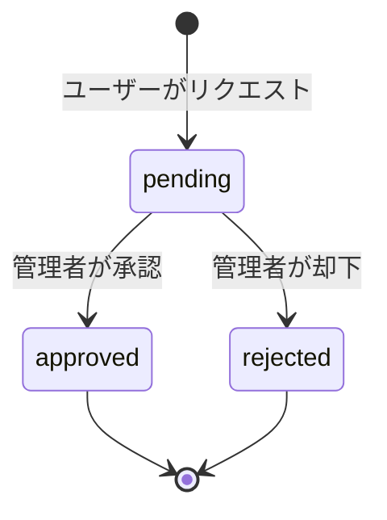

# プロジェクト用語集 (Glossary)

## 概要

このドキュメントは、ちゃくどんプロジェクト内で使用される用語の定義を管理します。ドメイン用語、技術用語、ステータス定義などを網羅的に記載し、開発者間の共通理解を促進します。

**更新日**: 2026-01-25

## ドメイン用語

プロジェクト固有のビジネス概念や機能に関する用語。

### ちゃくどん (Tyakudon)

**定義**: 本プロジェクトのサービス名。「着丼」に由来する。

**説明**: ラーメン愛好家が待ち時間を測定・共有し、行列の待ち時間を可視化するWebアプリケーション。ラーメン店の待ち時間を記録・共有することで、ユーザーは効率的にラーメン店を訪問できる。

**URL**: https://tyakudon.com

**由来**: 「着丼」（ラーメンが目の前に到着すること）から命名

**関連用語**: [着丼](#着丼-chakudon)、[接続](#接続-setsuzoku)、[レコード](#レコードrecord)

**英語表記**: Tyakudon

---

### 着丼 (Chakudon)

**定義**: ラーメンが提供され、目の前に到着すること。

**説明**: ユーザーが行列に並び始めてから、実際にラーメンが提供されるまでの一連のプロセスの終点。着丼時刻を記録することで、待ち時間が確定する。

**関連用語**: [接続](#接続-setsuzoku)、[待ち時間](#待ち時間-wait-time)、[レコード](#レコードrecord)

**使用例**:
- 「着丼ボタンを押す」: Record に ended_at を記録
- 「接続から着丼まで45分かかった」: wait_time = 45.0

**データモデル**: `Record.ended_at`

**英語表記**: Ramen Arrival, Completion

---

### 接続 (Setsuzoku)

**定義**: ラーメン店の行列に並び始めること。待ち時間測定の開始点。

**説明**: ユーザーが店舗に到着し、行列に並んだタイミングを記録する。この時点で Record が作成され、started_at が記録される。

**関連用語**: [着丼](#着丼-chakudon)、[レコード](#レコードrecord)、[行列状況](#行列状況-line-status)

**使用例**:
- 「接続ボタンを押す」: Record を作成し started_at を記録
- 「接続時の行列は10人」: LineStatus に line_number = 10 を記録

**データモデル**: `Record.started_at`

**英語表記**: Connection, Start of Waiting

---

### レコード（Record）

**定義**: 接続から着丼までの待ち時間を記録するエンティティ。

**説明**: ユーザーが特定のラーメン店で接続してから着丼するまでの時間、行列状況、コメントなどを含む記録。他のユーザーと共有され、店舗の混雑状況の参考になる。

**関連用語**: [接続](#接続-setsuzoku)、[着丼](#着丼-chakudon)、[待ち時間](#待ち時間-wait-time)、[行列状況](#行列状況-line-status)

**使用例**:
- 「レコードを投稿する」: 接続から着丼までの一連の記録を作成
- 「他のユーザーのレコードを見る」: 店舗別・ユーザー別のレコード一覧を閲覧

**データモデル**: `Record` (app/models/record.rb)

> **技術仕様**: フィールド定義、バリデーション、関連付け、メソッドなど詳細な実装仕様は [functional-design.md - エンティティ: Record](./functional-design.md#エンティティ-record待ち時間記録) を参照してください。

**英語表記**: Record

---

### 待ち時間 (Wait Time)

**定義**: 接続から着丼までの経過時間（秒単位で保存、表示時に分換算）。

**説明**: `ended_at - started_at` で計算され、秒単位で保存される。レコードの中核となる指標で、他のユーザーが店舗訪問の参考にする。

**関連用語**: [接続](#接続-setsuzoku)、[着丼](#着丼-chakudon)、[レコード](#レコードrecord)

**計算式**:
```ruby
wait_time = ended_at - started_at  # 秒単位で保存
```

**表示時の変換**:
```ruby
wait_time_in_minutes = (wait_time / 60).floor  # 表示時に分単位に変換
```

**データモデル**: `Record.wait_time`

**英語表記**: Wait Time

---

### 行列状況 (Line Status)

**定義**: 待ち時間測定中の行列の状態（待ち人数、待ち場所など）。

**説明**: ユーザーが接続時や待ち時間中に記録する行列の詳細情報。待ち人数（line_number）や待ち場所（line_type: 店内待ち、店外待ちなど）を含む。リアルタイムの混雑状況を共有する機能。

**関連用語**: [レコード](#レコードrecord)、[接続](#接続-setsuzoku)

**使用例**:
- 「接続時の行列状況を記録」: LineStatus を作成し line_number, line_type を記録
- 「現在15人待ち」: line_number = 15

**データモデル**: `LineStatus` (app/models/line_status.rb)

> **技術仕様**: フィールド定義、詳細な実装仕様は [functional-design.md - エンティティ: LineStatus](./functional-design.md#エンティティ-linestatus行列状況) を参照してください。

**英語表記**: Line Status

---

### 応援メッセージ (Cheer Message)

**定義**: 待ち時間中にユーザーを励ますために OpenAI API で生成されるメッセージ。

**説明**: ユーザーが待ち時間中に受け取る励ましのメッセージ。OpenAI API を使用して自動生成され、待ち時間のストレスを軽減する。SpeakCheerMessageJob がバックグラウンドで生成する。

**関連用語**: [レコード](#レコードrecord)、[SpeakCheerMessageJob](#speakcheermessagejob)

**使用例**:
- 「応援メッセージを生成」: SpeakCheerMessageJob → OpenAI API → CheerMessage 作成
- 「待ち時間中にメッセージを受け取る」: ユーザーが励まされる

**データモデル**: `CheerMessage` (app/models/cheer_message.rb)

> **技術仕様**: フィールド定義、詳細な実装仕様は [functional-design.md - エンティティ: CheerMessage](./functional-design.md#エンティティ-cheermessage応援メッセージ) を参照してください。

**技術**: OpenAI API (GPT モデル)

**英語表記**: Cheer Message

---

### お気に入り (Favorite)

**定義**: ユーザーが特定のラーメン店をお気に入りとして保存する機能。

**説明**: ユーザーが頻繁に訪問する店舗や気になる店舗を登録することで、マイページから簡単にアクセスできる。

**関連用語**: [ラーメン店](#ラーメン店-ramen-shop)、[ユーザー](#ユーザー-user)

**使用例**:
- 「店舗をお気に入りに追加」: Favorite を作成
- 「お気に入り店舗一覧を表示」: ユーザーの Favorite 一覧を表示

**データモデル**: `Favorite` (app/models/favorite.rb)

> **技術仕様**: フィールド定義、詳細な実装仕様は [functional-design.md - エンティティ: Favorite](./functional-design.md#エンティティ-favoriteお気に入り) を参照してください。

**英語表記**: Favorite

---

### いいね (Like)

**定義**: ユーザーが他のユーザーのレコードに対して「いいね」を付ける機能。

**説明**: レコードを参考にしたり、共感したりした際に「いいね」を付けることで、投稿者にフィードバックを提供する。

**関連用語**: [レコード](#レコードrecord)、[ユーザー](#ユーザー-user)

**使用例**:
- 「レコードにいいねを付ける」: Like を作成
- 「いいね数を表示」: レコードの likes_count を表示

**データモデル**: `Like` (app/models/like.rb)

> **技術仕様**: フィールド定義、詳細な実装仕様は [functional-design.md - エンティティ: Like](./functional-design.md#エンティティ-likeいいね) を参照してください。

**英語表記**: Like

---

### ラーメン店 (Ramen Shop)

**定義**: 待ち時間を測定する対象となるラーメン店舗。

**説明**: 店舗名、住所、位置情報（緯度経度）を持つ。Geocoder を使用して住所から座標を自動取得する。ユーザーはこの店舗に対して Record を作成する。

**関連用語**: [レコード](#レコードrecord)、[お気に入り](#お気に入り-favorite)、[Geocoder](#geocoder)

**使用例**:
- 「店舗を検索」: 名前や住所で RamenShop を検索
- 「店舗の位置をマップ表示」: latitude, longitude を使用

**データモデル**: `RamenShop` (app/models/ramen_shop.rb)

> **技術仕様**: フィールド定義、制約、詳細な実装仕様は [functional-design.md - エンティティ: RamenShop](./functional-design.md#エンティティ-ramenshopラーメン店舗) を参照してください。

**技術**: Geocoder gem で住所 → 座標変換

**英語表記**: Ramen Shop

---

### ユーザー (User)

**定義**: ちゃくどんを利用する登録ユーザー。

**説明**: パスワード認証または Google OAuth2 で認証される。レコードの投稿、お気に入り登録、いいね機能を利用できる。

**関連用語**: [レコード](#レコードrecord)、[お気に入り](#お気に入り-favorite)、[いいね](#いいね-like)

**認証方式**:
- パスワード認証（bcrypt）
- Google OAuth2

**データモデル**: `User` (app/models/user.rb)

> **技術仕様**: フィールド定義、詳細な実装仕様は [functional-design.md - エンティティ: User](./functional-design.md#エンティティ-userユーザー) を参照してください。

**英語表記**: User

---

### FAQ

**定義**: よくある質問と回答を管理するエンティティ。

**説明**: ユーザーがよく尋ねる質問とその回答を管理し、FAQ ページで表示する。管理者が作成・編集する。

**データモデル**: `FAQ` (app/models/faq.rb)

> **技術仕様**: フィールド定義、詳細な実装仕様は [functional-design.md - エンティティ: FAQ](./functional-design.md#エンティティ-faq) を参照してください。

**英語表記**: Frequently Asked Questions

---

### 店舗登録リクエスト (Shop Register Request)

**定義**: ユーザーが新しいラーメン店舗の登録をリクエストする機能。

**説明**: ユーザーが未登録の店舗を発見した際、管理者に登録をリクエストできる。管理者が承認すると RamenShop が作成される。

**関連用語**: [ラーメン店](#ラーメン店-ramen-shop)、[ユーザー](#ユーザー-user)

**ステータス**: [ShopRegisterRequest.status](#shopregisterrequeststatus)

**データモデル**: `ShopRegisterRequest` (app/models/shop_register_request.rb)

> **技術仕様**: フィールド定義、ステータス、詳細な実装仕様は [functional-design.md - エンティティ: ShopRegisterRequest](./functional-design.md#エンティティ-shopregisterrequest店舗登録リクエスト) を参照してください。

**英語表記**: Shop Register Request

---

## ステータス・状態

システム内で使用される各種ステータスの定義。

### Record.is_retired

**定義**: ユーザーが手動でレコードを終了したことを示すフラグ。

**説明**: ユーザーが途中で行列から離脱したり、何らかの理由で測定を中断した場合に true になる。

**取りうる値**: `true` / `false`

**デフォルト**: `false`

**使用例**:
- 行列が長すぎて諦めた場合
- 他の予定が入って離脱した場合

**関連用語**: [Record.auto_retired](#recordauto_retired)

---

### Record.auto_retired

**定義**: 1日経過したレコードを自動的に終了したことを示すフラグ。

**説明**: AutoRetireRecordJob が1日経過した未完了レコードを自動的に終了する際に true になる。

**取りうる値**: `true` / `false`

**デフォルト**: `false`

**実装**: AutoRetireRecordJob が毎日実行

**関連用語**: [Record.is_retired](#recordis_retired)、[AutoRetireRecordJob](#autoretirerecordjob)

---

### LineStatus.line_type

**定義**: 行列の待ち場所の種別を示す enum。

**説明**: ユーザーがどこで待っているかを記録する。店内待ち、店外待ち、着席済みなど。

**取りうる値**:
- `1`: `inside_the_store` - 店内待ち
- `2`: `outside_the_store` - 店外待ち
- `3`: `seated` - 着席済み

**実装コード**:
```ruby
enum line_type: { inside_the_store: 1, outside_the_store: 2, seated: 3 }
```

**データモデル**: `LineStatus.line_type` (integer, enum)

**英語表記**: Line Type

---

### CheerMessage.role

**定義**: 応援メッセージの役割を示す enum。

**説明**: メッセージの種類や文脈を分類する。OpenAIが生成したメッセージか、ユーザーが投稿したメッセージかを区別する。

**取りうる値**:
- `10`: `assistant` - OpenAIが生成
- `20`: `user` - ユーザーが投稿

**実装コード**:
```ruby
enum role: { assistant: 10, user: 20 }
```

**データモデル**: `CheerMessage.role` (integer, enum)

**英語表記**: Role

---

### ShopRegisterRequest.status

**定義**: 店舗登録リクエストの状態を示す enum。

**取りうる値**:

| ステータス | 意味 | 説明 |
|----------|------|------|
| `pending` | 承認待ち | リクエスト作成時の初期状態 |
| `approved` | 承認済み | 管理者が承認し、RamenShop 作成済み |
| `rejected` | 却下 | 管理者が却下 |

**状態遷移図**:


**データモデル**: `ShopRegisterRequest.status` (integer, enum)

**英語表記**: Status

---

## 技術用語

プロジェクトで使用している技術・フレームワーク・ツールに関する用語。

### Ruby

**定義**: 動的型付けオブジェクト指向スクリプト言語。

**公式サイト**: https://www.ruby-lang.org/

**本プロジェクトでの用途**: Rails アプリケーションの実装言語。

**バージョン**: 3.2.2

**選定理由**:
- Rails との親和性が高い
- 読みやすく書きやすい文法
- 豊富なライブラリ（gem）

**関連ドキュメント**: [アーキテクチャ設計書](./architecture.md#技術スタック)

---

### Ruby on Rails (Rails)

**定義**: Ruby で実装された MVC フレームワーク。Web アプリケーション開発を効率化する。

**公式サイト**: https://rubyonrails.org/

**本プロジェクトでの用途**: Web アプリケーションのフレームワーク。

**バージョン**: 7.0

**選定理由**:
- 高速な開発サイクル
- Convention over Configuration
- ActiveRecord による DB 操作の抽象化
- 豊富なエコシステム

**関連ドキュメント**: [アーキテクチャ設計書](./architecture.md#技術スタック)

**設定ファイル**: `config/application.rb`, `config/routes.rb`

---

### PostgreSQL

**定義**: オープンソースのリレーショナルデータベース管理システム。

**公式サイト**: https://www.postgresql.org/

**本プロジェクトでの用途**: メインデータベース。

**バージョン**: 14

**選定理由**:
- 高い信頼性と ACID 特性
- 地理情報（PostGIS）のサポート（将来的な拡張用）
- Rails との相性が良い

**関連ドキュメント**: [アーキテクチャ設計書](./architecture.md#データ永続化戦略)

**ホスティング**: Fly.io managed PostgreSQL

---

### ActiveRecord

**定義**: Rails の ORM（Object-Relational Mapping）ライブラリ。データベース操作を Ruby オブジェクトとして扱う。

**本プロジェクトでの用途**: すべてのモデルクラスの基底クラス。DB 操作の抽象化。

**選定理由**:
- Rails のデフォルト ORM
- 直感的なクエリインターフェース
- マイグレーション管理が容易

**使用例**:
```ruby
# N+1 クエリ防止
Record.includes(:user, :ramen_shop).all

# バリデーション
validates :name, presence: true, length: { maximum: 100 }
```

**関連ドキュメント**: [アーキテクチャ設計書](./architecture.md#データ永続化戦略)

---

### Bootstrap

**定義**: CSS フレームワーク。レスポンシブデザインを簡単に実装できる。

**公式サイト**: https://getbootstrap.com/

**本プロジェクトでの用途**: UI コンポーネントのスタイリング。

**選定理由**:
- 豊富な UI コンポーネント
- レスポンシブデザインが容易
- 学習コストが低い

**関連ドキュメント**: [機能設計書](./functional-design.md#ui設計)

---

### Hotwire

**定義**: Turbo + Stimulus で構成される、Rails のフロントエンド技術スタック。SPA のようなユーザー体験を提供。

**公式サイト**: https://hotwired.dev/

**本プロジェクトでの用途**: ページ遷移の高速化、リアルタイム更新。

**構成要素**:
- **Turbo**: ページ遷移の高速化、フレーム更新
- **Stimulus**: 軽量な JavaScript フレームワーク

**選定理由**:
- JavaScript を最小限に抑えられる
- Rails との統合が簡単
- SPA 風の体験を提供

**関連ドキュメント**: [機能設計書](./functional-design.md#ui設計)

---

### GoodJob

**定義**: PostgreSQL ベースのバックグラウンドジョブ処理ライブラリ。

**公式サイト**: https://github.com/bensheldon/good_job

**本プロジェクトでの用途**: AutoRetireRecordJob, SpeakCheerMessageJob の実行。

**選定理由**:
- Redis 不要（PostgreSQL のみで完結）
- 管理画面が充実
- Rails 7 との相性が良い

**関連ドキュメント**: [アーキテクチャ設計書](./architecture.md#技術スタック)

**実装箇所**: `app/jobs/`

---

### Geocoder

**定義**: 住所を緯度経度に変換する gem。

**公式サイト**: https://github.com/alexreisner/geocoder

**本プロジェクトでの用途**: RamenShop の住所 → 座標変換。

**選定理由**:
- 簡単に住所 → 座標変換が可能
- 複数の地理情報プロバイダーをサポート
- Rails との統合が容易

**使用例**:
```ruby
class RamenShop < ApplicationRecord
  geocoded_by :address
  after_validation :geocode
end
```

**関連ドキュメント**: [機能設計書](./functional-design.md#データモデル)

---

### OpenAI API

**定義**: OpenAI が提供する機械学習 API。GPT モデルを使用したテキスト生成が可能。

**公式サイト**: https://platform.openai.com/

**本プロジェクトでの用途**: 応援メッセージの自動生成。

**使用モデル**: GPT シリーズ

**選定理由**:
- 高品質な自然言語生成
- API が使いやすい

**関連ドキュメント**: [機能設計書](./functional-design.md#uc-4-応援メッセージ生成)

**実装箇所**: `app/jobs/speak_cheer_message_job.rb`

---

### Google OAuth2

**定義**: Google アカウントを使用した認証プロトコル。

**本プロジェクトでの用途**: ユーザー認証（パスワード認証と併用）。

**選定理由**:
- ユーザーの登録・ログインが簡単
- パスワード管理不要
- セキュリティが高い

**関連ドキュメント**: [アーキテクチャ設計書](./architecture.md#セキュリティ)

**設定**: Rails credentials (`gcp.client_id`, `gcp.client_secret`)

---

### Active Storage

**定義**: Rails の ファイルアップロード管理ライブラリ。

**本プロジェクトでの用途**: 将来的なファイルアップロード機能（プロフィール画像、店舗画像など）。

**ストレージ**:
- 開発環境: ローカルストレージ
- 本番環境: AWS S3

**関連ドキュメント**: [アーキテクチャ設計書](./architecture.md#データ永続化戦略)

---

### RSpec

**定義**: Ruby の BDD（振る舞い駆動開発）テストフレームワーク。

**公式サイト**: https://rspec.info/

**本プロジェクトでの用途**: ユニットテスト、統合テスト、システムテスト。

**選定理由**:
- Ruby のデファクトスタンダード
- 読みやすいテスト記述
- Rails との統合が容易

**関連ドキュメント**: [開発ガイドライン](./development-guidelines.md#テスト戦略)

**設定ファイル**: `spec/spec_helper.rb`, `spec/rails_helper.rb`

---

### FactoryBot

**定義**: テストデータを生成するライブラリ。

**公式サイト**: https://github.com/thoughtbot/factory_bot

**本プロジェクトでの用途**: RSpec テスト用のモデルデータ生成。

**使用例**:
```ruby
# spec/factories/users.rb
FactoryBot.define do
  factory :user do
    name { "テストユーザー" }
    email { "test@example.com" }
  end
end
```

**関連ドキュメント**: [開発ガイドライン](./development-guidelines.md#テスト戦略)

---

### RuboCop

**定義**: Ruby の静的コード解析ツール。コーディング規約の自動チェック。

**公式サイト**: https://rubocop.org/

**本プロジェクトでの用途**: コードスタイルのチェックと自動修正。

**選定理由**:
- Ruby コミュニティのデファクトスタンダード
- 自動修正機能が充実
- カスタマイズが容易

**関連ドキュメント**: [開発ガイドライン](./development-guidelines.md#コーディング規約)

**設定ファイル**: `.rubocop.yml`

**実行コマンド**:
```bash
bundle exec rubocop
bundle exec rubocop -a  # 自動修正
```

---

### Fly.io

**定義**: アプリケーションのホスティングプラットフォーム。

**公式サイト**: https://fly.io/

**本プロジェクトでの用途**: 本番環境のホスティング（アプリ + PostgreSQL）。

**選定理由**:
- Rails アプリのデプロイが簡単
- PostgreSQL のマネージドサービスが利用可能
- 無料枠が充実

**関連ドキュメント**: [アーキテクチャ設計書](./architecture.md#デプロイメント戦略)

---

### Service Object（非推奨）

⚠️ **非推奨**: 今後は `app/models/` にすべてのロジックを配置してください。
**現状**: 6つのファイルが存在し、`lib/tasks/scraping.thor` で使用されています（スクレイピングタスク用）。
**本プロジェクトでの位置づけ**:
- **方針変更**: Railsの思想 "Fat Model, Skinny Controller" に従い、新規ロジックは `app/models/` に配置
- **既存ファイル**: スクレイピングワークフロー専用として維持
- **代替案**: 外部API連携やHTTPクライアントは `app/models/` 配下にPOROとして実装

**配置場所**: `app/services/` (既存), `app/models/` (新規)

**app/models/ の3分類**:
1. **ActiveRecord**: DBテーブルに紐づくモデル (例: `user.rb`, `record.rb`)
2. **Concerns**: 共有する振る舞い (例: `concerns/retirable.rb`)
3. **PORO**: 単独のロジック (例: 外部HTTPクライアント)

**関連ドキュメント**: [アーキテクチャ設計書](./architecture.md#アーキテクチャレイヤー)

---

### Concerns (ActiveSupport::Concern)

**定義**: モデル間で共通する振る舞いを抽出・共有する Rails の標準パターン。

**現状**: `app/models/concerns/` ディレクトリは現在空です（.keepファイルのみ）

**本プロジェクトでの位置づけ**: 優先的に使用（将来的な実装）

**配置場所**: `app/models/concerns/`

**命名規則**: 形容詞形（-able）または機能名

**選定理由**:
- モデルの肥大化を防ぐ
- 共通ロジックの再利用性向上
- Rails標準の仕組みでテストが容易

**将来的な実装候補**:
- Geocodable（位置情報取得の振る舞い）
- Likeable（いいね機能の振る舞い）
- Retirable（終了処理の振る舞い）
- Searchable（検索機能の振る舞い）

**関連ドキュメント**: [アーキテクチャ設計書](./architecture.md#アーキテクチャレイヤー)

**実装例**:
```ruby
# app/models/concerns/retirable.rb （実装例）
module Retirable
  extend ActiveSupport::Concern

  included do
    scope :active, -> { where(ended_at: nil, is_retired: false) }
  end

  def retire!
    update(is_retired: true, ended_at: Time.current)
  end
end
```

---

### Models ディレクトリの構成

**定義**: Railsの `app/models/` ディレクトリには、すべてのアプリケーションロジックを配置する。

**本プロジェクトでの構成**:
`app/models/` 配下には以下の3種類のクラスを配置します。

**1. ActiveRecord モデル**:
- DBテーブルに紐づくモデル
- 配置例: `app/models/user.rb`, `app/models/record.rb`
- 役割: データ検証、関連付け、ビジネスロジック

**2. Concerns**:
- 共有する振る舞いを抽出したモジュール
- 配置: `app/models/concerns/`
- 命名: 形容詞形（-able）または機能名
- 例: `retirable.rb`, `geocodable.rb`, `likeable.rb`

**3. PORO (Plain Old Ruby Object)**:
- 単独のロジックを持つクラス（外部クライアント等）
- 配置例: `app/models/document_fetcher.rb`（将来的な実装）
- 役割: 外部API連携、HTTPクライアント、複雑なデータ変換

**配置例**:
```
app/models/
├── concerns/              # 共有する振る舞い
│   ├── retirable.rb
│   └── geocodable.rb
├── user.rb                # ActiveRecord
├── record.rb              # ActiveRecord
└── (future) document_fetcher.rb  # PORO（外部クライアント）
```

**関連ドキュメント**: [リポジトリ構造定義書](./repository-structure.md#appmodels)

---

## 略語・頭字語

### MAU

**正式名称**: Monthly Active Users

**意味**: 月間アクティブユーザー数。

**本プロジェクトでの使用**: KPI として設定。目標 500 MAU。

**関連ドキュメント**: [プロダクト要求定義書](./product-requirements.md#kpi重要指標)

---

### DAU

**正式名称**: Daily Active Users

**意味**: 日間アクティブユーザー数。

**本プロジェクトでの使用**: KPI として設定（DAU/MAU 比率）。

**関連ドキュメント**: [プロダクト要求定義書](./product-requirements.md#kpi重要指標)

---

### OAuth

**正式名称**: Open Authorization

**意味**: 第三者アプリケーションがユーザーの認証情報を取得せずにリソースへのアクセスを許可する認可プロトコル。

**本プロジェクトでの使用**: Google OAuth2 によるユーザー認証。

**関連用語**: [Google OAuth2](#google-oauth2)

**関連ドキュメント**: [アーキテクチャ設計書](./architecture.md#セキュリティ)

---

### CSRF

**正式名称**: Cross-Site Request Forgery

**意味**: クロスサイトリクエストフォージェリ。Webアプリケーションの脆弱性の一種。

**本プロジェクトでの対策**: Rails のデフォルト CSRF 保護機能を使用。

**関連ドキュメント**: [アーキテクチャ設計書](./architecture.md#セキュリティ)

---

### XSS

**正式名称**: Cross-Site Scripting

**意味**: クロスサイトスクリプティング。Webアプリケーションの脆弱性の一種。

**本プロジェクトでの対策**: Rails のデフォルトエスケープ処理を使用。

**関連ドキュメント**: [アーキテクチャ設計書](./architecture.md#セキュリティ)

---

### ORM

**正式名称**: Object-Relational Mapping

**意味**: オブジェクトとリレーショナルデータベースのマッピング技術。

**本プロジェクトでの使用**: ActiveRecord を ORM として使用。

**関連用語**: [ActiveRecord](#activerecord)

---

### API

**正式名称**: Application Programming Interface

**意味**: アプリケーション間のインターフェース。

**本プロジェクトでの使用**:
- OpenAI API（応援メッセージ生成）
- Google OAuth2 API（認証）
- 将来的な REST API 提供

**関連ドキュメント**: [機能設計書](./functional-design.md)

---

### REST

**正式名称**: Representational State Transfer

**意味**: Web API の設計原則。

**本プロジェクトでの使用**: Rails のデフォルトルーティングが RESTful。

**関連ドキュメント**: [アーキテクチャ設計書](./architecture.md#アーキテクチャレイヤー)

---

### JSON

**正式名称**: JavaScript Object Notation

**意味**: データ交換フォーマット。

**本プロジェクトでの使用**: API レスポンス、設定ファイルなど。

---

### ERB

**正式名称**: Embedded Ruby

**意味**: Ruby を埋め込んだテンプレートエンジン。

**本プロジェクトでの使用**: View ファイル（`.html.erb`）。

**関連ドキュメント**: [機能設計書](./functional-design.md#ui設計)

---

### SQL

**正式名称**: Structured Query Language

**意味**: リレーショナルデータベースの操作言語。

**本プロジェクトでの使用**: ActiveRecord が SQL を自動生成。直接 SQL を書くことも可能。

**関連用語**: [PostgreSQL](#postgresql), [ActiveRecord](#activerecord)

---

### CI/CD

**正式名称**: Continuous Integration / Continuous Deployment

**意味**: 継続的インテグレーション / 継続的デプロイメント。

**本プロジェクトでの使用**: GitHub Actions で CI/CD パイプラインを構築。

**関連ドキュメント**: [アーキテクチャ設計書](./architecture.md#デプロイメント戦略)

---

## アーキテクチャ用語

システム設計・アーキテクチャに関する用語。

### MVC (Model-View-Controller)

**定義**: Rails のデフォルトアーキテクチャパターン。アプリケーションを3つの役割に分割。

**本プロジェクトでの適用**: Rails の MVC パターン + Service Object パターン。

```
┌─────────────────────────────────────────┐
│  View Layer (ERB, Stimulus)             │ ← ユーザー表示
├─────────────────────────────────────────┤
│  Controller Layer                       │ ← リクエスト処理
├─────────────────────────────────────────┤
│  Service Layer (Service Objects)        │ ← ビジネスロジック
├─────────────────────────────────────────┤
│  Model Layer (ActiveRecord)             │ ← データ操作
└─────────────────────────────────────────┘
```

**メリット**:
- 関心の分離による保守性向上
- 各層を独立してテスト可能
- 変更の影響範囲が限定的

**依存関係のルール**:
- View → Controller (OK)
- Controller → Service → Model (OK)
- Model → Service (NG)

**関連ドキュメント**: [アーキテクチャ設計書](./architecture.md#アーキテクチャレイヤー)

---

### Convention over Configuration

**定義**: Rails の設計哲学。設定より規約を優先する。

**説明**: ファイル名、クラス名、ディレクトリ構造などを規約に従って配置することで、設定ファイルを最小限に抑える。

**例**:
- Model: `User` → テーブル名: `users`
- Controller: `UsersController` → ルーティング: `/users`
- View: `app/views/users/index.html.erb`

**関連ドキュメント**: [開発ガイドライン](./development-guidelines.md#命名規則)

---

### RESTful ルーティング

**定義**: REST 原則に基づいたルーティング設計。

**本プロジェクトでの適用**: Rails のデフォルトルーティング。

**主要なルート**:
- `GET /users` → UsersController#index
- `GET /users/:id` → UsersController#show
- `POST /users` → UsersController#create
- `PATCH /users/:id` → UsersController#update
- `DELETE /users/:id` → UsersController#destroy

**関連ドキュメント**: [アーキテクチャ設計書](./architecture.md#アーキテクチャレイヤー)

---

### N+1 クエリ問題

**定義**: データベースクエリが非効率に発行される問題。

**説明**: 関連データを取得する際、ループ内で毎回クエリが発行されてしまう問題。

**本プロジェクトでの対策**: `includes`, `eager_load` を使用。

**悪い例**:
```ruby
# N+1 問題発生
records = Record.all
records.each do |record|
  puts record.user.name  # 毎回 User テーブルにクエリ
end
```

**良い例**:
```ruby
# N+1 問題解決
records = Record.includes(:user).all
records.each do |record|
  puts record.user.name  # クエリは1回のみ
end
```

**関連ドキュメント**: [開発ガイドライン](./development-guidelines.md#パフォーマンス最適化)

---

## エラー・例外

システムで定義されているエラーと例外。

### ActiveRecord::RecordInvalid

**クラス名**: `ActiveRecord::RecordInvalid`

**継承元**: `ActiveRecord::ActiveRecordError`

**発生条件**: モデルのバリデーションエラー。

**プロパティ**:
- `record`: バリデーションエラーが発生したレコード
- `record.errors`: エラー詳細

**対処方法**:
- ユーザー: エラーメッセージに従って入力を修正
- 開発者: バリデーションルールが正しいか確認

**使用例**:
```ruby
user = User.new(name: "", email: "")
user.save!  # ActiveRecord::RecordInvalid 発生
```

**主なバリデーションルール**:
- `presence: true` - 必須
- `length: { maximum: 100 }` - 最大文字数
- `uniqueness: true` - 一意性

**関連ドキュメント**: [開発ガイドライン](./development-guidelines.md#エラーハンドリング)

---

### ActiveRecord::RecordNotFound

**クラス名**: `ActiveRecord::RecordNotFound`

**継承元**: `ActiveRecord::ActiveRecordError`

**発生条件**: 指定された ID のレコードが見つからない場合。

**対処方法**:
- ユーザー: 正しい ID を指定
- 開発者: `find` の代わりに `find_by` を使用し、nil チェックを行う

**使用例**:
```ruby
User.find(9999)  # ActiveRecord::RecordNotFound 発生
```

**安全な代替手段**:
```ruby
user = User.find_by(id: 9999)
if user.nil?
  # エラー処理
end
```

**関連ドキュメント**: [開発ガイドライン](./development-guidelines.md#エラーハンドリング)

---

## バックグラウンドジョブ

### AutoRetireRecordJob

**定義**: 1日経過した未完了レコードを自動的に終了するバックグラウンドジョブ。

**実行タイミング**: Record作成時に `schedule_auto_retire` コールバックで1日後に実行をスケジュール

**処理内容**:
1. ended_at が nil のレコードを対象
2. `record.auto_retire!` を実行してレコードを終了
3. `UserMailer.notify_retirement` でユーザーにメール通知

**実装詳細**:
```ruby
def perform(record)
  return if record.ended_at?

  record.auto_retire!
  UserMailer.notify_retirement(record.user, record).deliver_now  # メール通知
end
```

**トリガー**: Record作成時に `schedule_auto_retire` コールバックで1日後に実行をスケジュール

**関連用語**: [Record.auto_retired](#recordauto_retired)

**実装箇所**: `app/jobs/auto_retire_record_job.rb`

**英語表記**: Auto Retire Record Job

---

### SpeakCheerMessageJob

**定義**: OpenAI API を使用して応援メッセージを生成するバックグラウンドジョブ。

**実行タイミング**: ユーザーがリクエストした時

**処理内容**:
1. OpenAI API にリクエスト
2. 応援メッセージを生成
3. CheerMessage レコードを作成

**関連用語**: [応援メッセージ](#応援メッセージ-cheer-message)、[OpenAI API](#openai-api)

**実装箇所**: `app/jobs/speak_cheer_message_job.rb`

**英語表記**: Speak Cheer Message Job

---

## サービス (Service Objects)

### DocumentFetcher

**定義**: Web スクレイピングを担当するサービス。

**本プロジェクトでの用途**: 外部サイトから HTML を取得する。

**実装箇所**: `app/services/document_fetcher.rb`

**英語表記**: Document Fetcher

---

### ShopInfoExtractor

**定義**: スクレイピングした HTML からラーメン店舗情報を抽出するサービス。

**本プロジェクトでの用途**: 店舗名、住所などを抽出。

**実装箇所**: `app/services/shop_info_extractor.rb`

**英語表記**: Shop Info Extractor

---

### ShopInfoInserter

**定義**: 抽出した店舗情報を RamenShop に登録するサービス。

**本プロジェクトでの用途**: RamenShop レコードの作成。

**実装箇所**: `app/services/shop_info_inserter.rb`

**英語表記**: Shop Info Inserter

---

### GoogleSpreadSheet

**定義**: Google スプレッドシートとの連携を担当するサービス。

**本プロジェクトでの用途**: スクレイピングワークフロー用のデータ管理。

**実装箇所**: `app/services/google_spread_sheet.rb`

**英語表記**: Google Spread Sheet

---

### GcpSessionManager

**定義**: Google Cloud Platform (GCP) のセッション管理を担当するサービス。

**本プロジェクトでの用途**: Google API のセッション管理。

**実装箇所**: `app/services/gcp_session_manager.rb`

**英語表記**: GCP Session Manager

---

### UrlManager

**定義**: URL 管理を担当するサービス。

**本プロジェクトでの用途**: スクレイピング対象の URL 管理。

**実装箇所**: `app/services/url_manager.rb`

**英語表記**: URL Manager

---

## 索引

### あ行
- [いいね](#いいね-like) - ドメイン用語
- [応援メッセージ](#応援メッセージ-cheer-message) - ドメイン用語
- [お気に入り](#お気に入り-favorite) - ドメイン用語

### か行
- [行列状況](#行列状況-line-status) - ドメイン用語

### さ行
- [接続](#接続-setsuzoku) - ドメイン用語
- [店舗登録リクエスト](#店舗登録リクエスト-shop-register-request) - ドメイン用語

### た行
- [着丼](#着丼-chakudon) - ドメイン用語
- [ちゃくどん](#ちゃくどん-tyakudon) - ドメイン用語

### ま行
- [待ち時間](#待ち時間-wait-time) - ドメイン用語

### や行
- [ユーザー](#ユーザー-user) - ドメイン用語

### ら行
- [ラーメン店](#ラーメン店-ramen-shop) - ドメイン用語
- [レコード](#レコードrecord) - ドメイン用語

### A-Z
- [ActiveRecord](#activerecord) - 技術用語
- [ActiveRecord::RecordInvalid](#activerecordrecordinvalid) - エラー
- [ActiveRecord::RecordNotFound](#activerecordrecordnotfound) - エラー
- [Active Storage](#active-storage) - 技術用語
- [API](#api) - 略語
- [AutoRetireRecordJob](#autoretirerecordjob) - バックグラウンドジョブ
- [Bootstrap](#bootstrap) - 技術用語
- [CheerMessage.role](#cheermessagerole) - ステータス
- [CI/CD](#cicd) - 略語
- [Convention over Configuration](#convention-over-configuration) - アーキテクチャ用語
- [CSRF](#csrf) - 略語
- [DAU](#dau) - 略語
- [DocumentFetcher](#documentfetcher) - サービス
- [ERB](#erb) - 略語
- [FactoryBot](#factorybot) - 技術用語
- [FAQ](#faq) - ドメイン用語
- [Fly.io](#flyio) - 技術用語
- [GcpSessionManager](#gcpsessionmanager) - サービス
- [Geocoder](#geocoder) - 技術用語
- [GoodJob](#goodjob) - 技術用語
- [Google OAuth2](#google-oauth2) - 技術用語
- [GoogleSpreadSheet](#googlespreadsheet) - サービス
- [Hotwire](#hotwire) - 技術用語
- [JSON](#json) - 略語
- [LineStatus.line_type](#linestatusline_type) - ステータス
- [MAU](#mau) - 略語
- [MVC](#mvc-model-view-controller) - アーキテクチャ用語
- [N+1 クエリ問題](#n1-クエリ問題) - アーキテクチャ用語
- [OAuth](#oauth) - 略語
- [OpenAI API](#openai-api) - 技術用語
- [ORM](#orm) - 略語
- [PostgreSQL](#postgresql) - 技術用語
- [Record.auto_retired](#recordauto_retired) - ステータス
- [Record.is_retired](#recordis_retired) - ステータス
- [REST](#rest) - 略語
- [RESTful ルーティング](#restful-ルーティング) - アーキテクチャ用語
- [RSpec](#rspec) - 技術用語
- [Ruby](#ruby) - 技術用語
- [Ruby on Rails](#ruby-on-rails-rails) - 技術用語
- [RuboCop](#rubocop) - 技術用語
- [Service Object](#service-object) - 技術用語
- [ShopInfoExtractor](#shopinfoextractor) - サービス
- [ShopInfoInserter](#shopinfoinserter) - サービス
- [ShopRegisterRequest.status](#shopregisterrequeststatus) - ステータス
- [SpeakCheerMessageJob](#speakcheermessagejob) - バックグラウンドジョブ
- [SQL](#sql) - 略語
- [UrlManager](#urlmanager) - サービス
- [XSS](#xss) - 略語

---

**最終更新**: 2026-01-25
